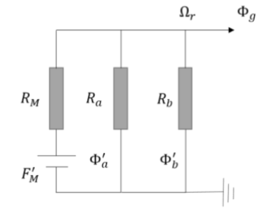
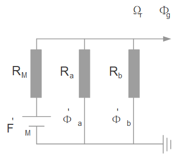
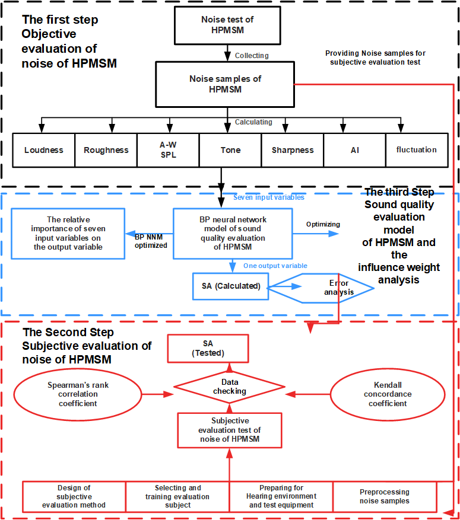

# Visio Diagram Replica Workflow

这是一个面向 Codex 的 Visio 复刻 skill，用来把参考图、截图、白板照片、流程图、系统结构图或科研示意图转换成可编辑的 Microsoft Visio `.vsdx` 文件，并同步导出 PNG/EMF 预览图用于快速校对。

它的核心思路是：先把参考图拆成稳定的 JSON 绘图计划，再通过 Visio COM 或跨会话代理生成最终图纸。这样既方便自动化批量出图，也保留了后续手工微调的空间。

## 适用场景

- 根据论文截图复刻电路图、框图、流程图
- 把白板草图整理成可编辑的 Visio 文档
- 在沙箱环境里通过代理生成 Visio 图
- 需要同时交付 `.vsdx`、预览图和绘图计划 JSON
- 需要录屏演示 Visio 复刻流程

## 主要能力

- 自动按参考图像素建立页面坐标系
- 用 JSON 计划描述矩形、椭圆、文本、折线和箭头
- 支持直接 COM 生成和代理生成两条路径
- 支持导出 PNG 预览，便于快速肉眼 QA
- 支持把经验沉淀为可复用脚本和计划模板

## 目录结构

```text
visio-diagram-replica-workflow/
├── SKILL.md
├── README.md
├── agents/
│   └── openai.yaml
├── references/
│   └── plan_schema_and_qa.md
├── scripts/
│   ├── check_visio_environment.ps1
│   ├── check_visio_proxy.ps1
│   ├── create_visio_direct_from_plan.ps1
│   ├── create_visio_from_plan.ps1
│   ├── create_visio_via_proxy.ps1
│   ├── invoke_visio_proxy.ps1
│   ├── start_visio_proxy.bat
│   ├── stop_visio_proxy.bat
│   ├── visio_proxy_client.py
│   └── visio_proxy_server.ps1
└── examples/
    ├── equivalent-circuit/
    │   ├── reference.png
    │   ├── preview.png
    │   └── plan.json
    └── research-flow/
        ├── preview.png
        └── plan.json
```

## 环境要求

- Windows
- 已安装 Microsoft Visio
- PowerShell 5.1 或更高版本
- 需要代理模式时，允许交互用户启动 `scripts/start_visio_proxy.bat`

## 安装方式

把整个仓库目录复制到你的 Codex skills 目录中，目录名保持为 `visio-diagram-replica-workflow`：

```powershell
Copy-Item .\visio-diagram-replica-workflow "$env:USERPROFILE\.codex\skills\visio-diagram-replica-workflow" -Recurse
```

安装后，可以在提示词里直接调用：

```text
Use $visio-diagram-replica-workflow to replicate this reference diagram as an editable Visio file and export a preview.
```

## 快速开始

1. 检查 Visio 和导出环境

```powershell
powershell -ExecutionPolicy Bypass -File scripts\check_visio_environment.ps1
```

2. 准备一个 JSON 绘图计划

```json
{
  "page": {
    "name": "Demo",
    "widthPx": 800,
    "heightPx": 600,
    "scalePxPerInch": 100
  },
  "referenceImage": "E:/temp/reference.png",
  "shapes": []
}
```

3. 直接通过 COM 生成 Visio

```powershell
powershell -ExecutionPolicy Bypass -File scripts\create_visio_direct_from_plan.ps1 `
  -PlanPath .\examples\equivalent-circuit\plan.json `
  -OutVsdx .\equivalent-circuit.vsdx `
  -OutPreview .\equivalent-circuit.png
```

4. 如果你在沙箱环境中工作，再改用主脚本或代理脚本

```powershell
scripts\start_visio_proxy.bat

powershell -ExecutionPolicy Bypass -File scripts\create_visio_from_plan.ps1 `
  -PlanPath .\examples\equivalent-circuit\plan.json `
  -OutVsdx .\equivalent-circuit.vsdx `
  -OutPreview .\equivalent-circuit.png

scripts\stop_visio_proxy.bat
```

## 工作流程建议

1. 先读取项目 `AGENTS.md`
2. 用参考图像素尺寸作为页面坐标系
3. 把图拆成区域、图元、文字、箭头和连线
4. 先完成稳定的 `plan.json`
5. 生成 `.vsdx` 和预览图
6. 只修高影响差异：缺形状、箭头方向、明显错位、严重文字重叠

## 图片示例

### 示例 1：电路图复刻

原始参考图：



生成后的 Visio 预览：



对应绘图计划见 [examples/equivalent-circuit/plan.json](examples/equivalent-circuit/plan.json)。

### 示例 2：科研流程图复刻

生成后的 Visio 预览：



对应绘图计划见 [examples/research-flow/plan.json](examples/research-flow/plan.json)。

## 常见问题

### 1. 代理卡住了怎么办？

先运行：

```powershell
powershell -ExecutionPolicy Bypass -File scripts\check_visio_proxy.ps1
```

如果锁文件还在但对应 PID 已失效，优先改用 `create_visio_direct_from_plan.ps1`。

### 2. 文字为什么和原图不完全一样？

Visio 自动化适合稳定复刻结构、布局和连接关系。论文里的数学排版、prime、特殊上下标和字距，有时需要在生成后做少量人工微调。

### 3. 应该保留哪些交付物？

建议至少保留三类文件：

- `.vsdx`：可编辑源文件
- `.png` 或 `.emf`：预览图
- `plan.json`：可复用的绘图计划

## 说明

`SKILL.md` 是给 Codex 读的操作说明；本 `README.md` 是给 GitHub 读者看的中文介绍。两者职责不同，所以保留了双文档结构。
